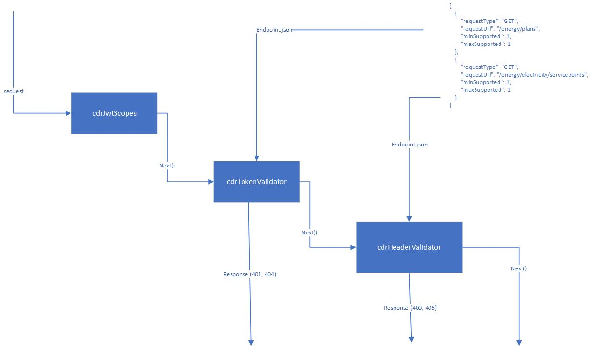

# DSB Middleware

## Disclaimer

The artefacts in this repo are offered without warranty or liability, in accordance with the [MIT licence.](https://github.com/ConsumerDataStandardsAustralia/java-artefacts/blob/master/LICENSE)

[The Data Standards Body](https://www.csiro.au/en/News/News-releases/2018/Data61-appointed-to-Data-Standards-Body-role)
(DSB) develops these artefacts in the course of its work, in order to perform quality assurance on the Australian Consumer Data Right Standards (Data Standards).

The DSB makes this repo, and its artefacts, public [on a non-commercial basis](https://github.com/ConsumerDataStandardsAustralia/java-artefacts/blob/master/LICENSE)
in the interest of supporting the participants in the CDR eco-system.

The resources of the DSB are primarily directed towards assisting the [Data Standards Chair](https://consumerdatastandards.gov.au/about/)
for [developing the Data Standards](https://github.com/ConsumerDataStandardsAustralia/standards).

Consequently, the development work provided on the artefacts in this repo is on a best-effort basis,
and the DSB acknowledges the use of these tools alone is not sufficient for, nor should they be relied upon
with respect to [accreditation](https://www.accc.gov.au/focus-areas/consumer-data-right-cdr-0/cdr-draft-accreditation-guidelines),
conformance, or compliance purposes.

## The Problem

In line with the Australian Consumer Data Rights legislation the Data Standards Body defines a number of technical requirements on API endpoints for various industry sector. In particular the standard defines error payloads to be a specific format, containing specific error codes, etc.
Because these error handling requirements across a large number of endpoints, coding these can be repetitive and therefore error prone.

## The Solution

This packages is a boilerplate implementation of these common requirements and it can be used in any NodeJS / ExpressJS application as middleware.

The key functions exported by this package are `cdrHeaders, cdrAuthorisation, and cdrJwtScopes`.

### cdrHeaders

This middleware function will handle some basic header checks and construct a CDR compliant *ErrorList* object where this required and return an appropriate Http status code.

| Scenario      | Description |
| ----------- | ----------- |
| No x-v header is provided in the request    | - Http status code 400   - An *ErrorList* is returned with Header/Missing.    |
| Invalid x-v header is provided with the request, eg alpha character   | - Http status code 400   - An *ErrorList* is returned with Header/Invalid. |
| Invalid x-min-v header is provided with the request |  Http status code 400   - An *ErrorList* is returned with Header/Invalid. |
| A requested version is not supported | - Http status code 406   - An *ErrorList* is returned with Header/UnsupportedVersion. |
| No x-fapi-interaction-id  in the request    | An x-fapi-interaction-id header is set in the response header    |
| Request has x-fapi-interaction-id header    | The x-fapi-interaction-id from the request is returned with the response header   |
| Invalid x-fapi-interaction-id header is provided with the request  | - Http status code 400   - An *ErrorList* is returned with Header/Invalid. |

### cdrAuthorisation

This middleware function will handle some basic authorisation checks and construct a CDR compliant *ErrorList* object where this required and return an appropriate Http status code.
Note that some of the functionality here requires access to the scopes contained from access token generated by the IdAM  (Identity and Access Management System).  For a common scenario where the access token is being issued as a JWT, the cdrJwtScopes middleware can be utilised to extend the Request object accordingly.

| Scenario      | Description |
| ----------- | ----------- |
| No authorisation header present in Request     | Http status code 401       |
| Authorisation header is present, invalid scope in access token   | - Http status code 403   - An *ErrorList* is returned with Authorisation/InvalidScope |
| Authorisation header is present, endpoint not implemented | - Http status code 404   - An *ErrorList* is returned with Resource/NotImplemented. |
| Authorisation header is present, endpoint not is not a CDR endpoint | - Http status code 404   - An *ErrorList* is returned with Resource/NotFound. |

### cdrJwtScopes

This middleware function will extend the Request object and make the scopes contained in the access token accessible from the Request object.

This can be used for any IdAM which returns the access token as an JWT and the scopes property is either an array of strings or a space separated string.
The middleware will expect a configuration object.

| Scenario      | Description |
| ----------- | ----------- |
| The access token from the IdAM is a JWT and scopes are an array of strings    | The request object will be extended      |
| The access token from the IdAM is a JWT and scopes are a space separated string   |The request object will be extended  |